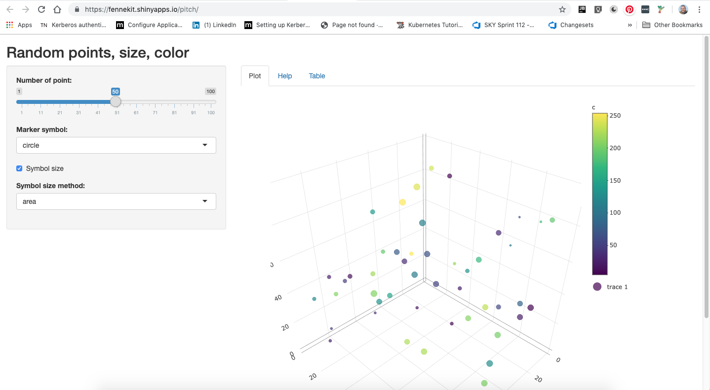

```{r setup, include=FALSE}
knitr::opts_chunk$set(echo = FALSE)
```

## Current situation

Currently in our company we use slides generated with Kniter with embedded R code that is executed when we generate the slide decks.

This can be used with interactive plots but has limited interaction. 

In this slide deck I build a case for the use of Shiny Apps


## Shiny Apps

Shiny is an R package that makes it easy to build interactive web apps straight from R.

In our company we can write R, so we can create interactive application show casing our research results.

## Plotly 3D plot

For example this embeded Plotly graph

```{r echo=FALSE, message=FALSE, warning=FALSE}
library("plotly")
n <- 25;
 
x <- runif(n , 0, 100)
y <- runif(n , 0, 100)

z <- runif(n , 0, 100)
 
r <- runif(n, 2, 50)
c <- runif(n, 0, 255)
 
data <-data.frame(x, y, z, r, c)
 
p <- plot_ly(data, x = ~x, y = ~y, z = ~z, color = ~c, size = ~r, marker = list(symbol = 'circle', sizemode = 'diameter'),
 type="scatter3d", mode="markers") %>% 
    layout(title = 'Random points, size, color')

p
```

## As a Shiny app
Can be made interactive using Shiny. Go for it.

```{r}
# All defaults
library("knitr")

```